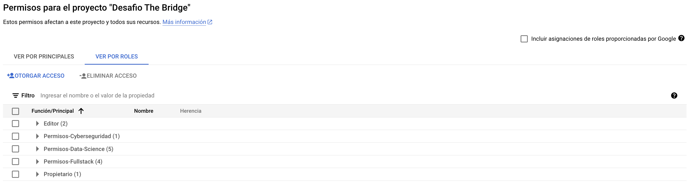
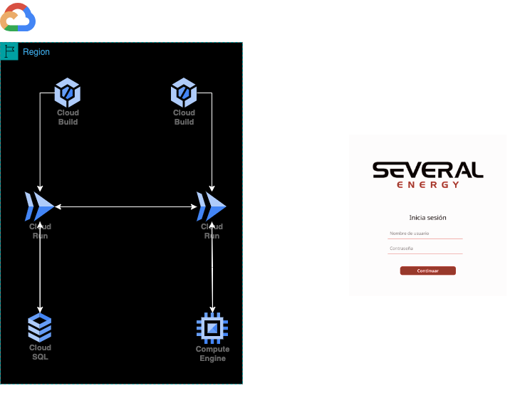
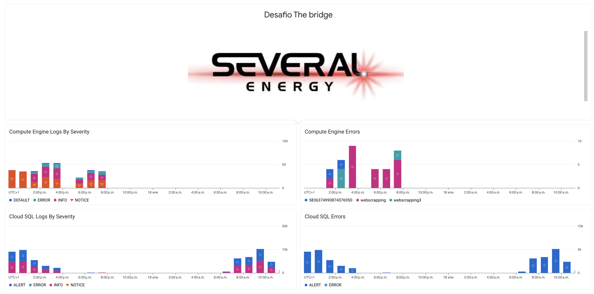

# 
DESAFÍO DE TRIPULACIONES
 

### Índice:
1. [Gestión de permisos y control de versiones](#1-gestión-de-permisos-y-control-de-versiones) 🛡️
2. [Diseño de la Arquitectura](#2-diseño-de-la-arquitectura) 🏗️
3. [Infraestructura como código (IaC)](#3-infraestructura-como-código-iac) 💻
4. [Despliegue e implementación contínuos (CI/CD)](#4-despliegue-e-implementación-contínuos-cicd) 🔄
5. [Hardening en Colaboración con Ciberseguridad](#5-hardening-en-colaboración-con-ciberseguridad) 🔐
6. [Web Scraping para Obtener Datos](#6-web-scraping-para-obtener-datos) 🌐
7. [Monitorización](#7-monitorización) 📊
8. [Source(links)](#8-source)
#

### 1. Gestión de permisos y control de versiones:
Para salvaguardar nuestra infraestructura en GCP, creamos tres grupos (ciberseguridad, data science, full-stack) y asignamos roles y permisos. Limitamos los permisos a lo esencial. Mantén la aplicación bajo vigilancia constante. ¡Protege y controla! 🔐

# 

### 2. Diseño de la Arquitectura:
Utilizaremos Cloud Build para el creado de los servidores con la ayuda del Cloud Run, Cloud SQL para la base de datos PostgreSQL. Una VM para el API del web scraping, Monitorización con Cloud Monitoring y Cloud Logging. ¡Optimizando para el rendimiento sin complicaciones!🏗️. 

#  

**🛠️ Tecnologías y Herramientas:**

- Plataforma Cloud: Google Cloud Platform (GCP) ☁️
- Infraestructura como Código (IaC): Terraform 🏗️
- CI/CD: GitHub para control de versiones 🔄, Docker 🐳 para contenedores, Cloud Build
- Computación en la Nube: Cloud Run para ejecutar contenedores 🚀
- Sistema Operativo en la Nube: Ubuntu 🐧
- Base de Datos en la Nube: Cloud SQL para SQL 🗄️
#
**📝 Desarrollo y Directrices Específicas:**
- 🛠️ Selección y Gestión de la Cuenta de Cloud
  - Elegir cuenta de Cloud asociada al grupo del proyecto.
  - Gestionar la gratuidad para el tiempo que dure el desafío de tripulaciones.
  - Establecer niveles de acceso y edición de recursos para los miembros del equipo.

- 🌐 Configuración de la Infraestructura en la Nube y Automatización de Despliegue
  - Configurar la infraestructura de la nube con Cloud Build y GCP.
  - Automatización del aprovisionamiento y la gestión de la infraestructura mediante código (Infrastructure as Code).
#
### 3. Infraestructura como código (IaC):
Terraform será nuestro aliado para crear y gestionar la infraestructura en GCP. Adaptaremos los scripts para manejar recursos específicos como Cloud SQL. ¡Despliega tu infraestructura con un solo clic! [Terraform docs.](/terraform/)💻
#
### 4. Despliegue e implementación contínuos (CI/CD):
Cloud Build de GCP será nuestra herramienta principal para lograr un despliegue continuo. Integraremos Cloud Build con nuestro repositorio en GitHub, activando un proceso de CI/CD en cada push. Compilará, probará y desplegará automáticamente la aplicación. Utilizaremos también Dockerfile para empaquetar la imagen y Docker Compose para orquestar los contenedores correspondientes. ¡Automatización para la eficiencia! 🔄 🐳
# !

### 5. Hardening en Colaboración con Ciberseguridad:
En colaboración con el equipo de ciberseguridad, implementamos medidas de **hardening** para fortalecer la seguridad de la infraestructura. El **hardening** implica configurar sistemas y aplicaciones de manera segura, reduciendo las vulnerabilidades y fortaleciendo las defensas. Trabajamos juntos para aplicar las mejores prácticas de seguridad y garantizar la integridad y confidencialidad de nuestros sistemas. [hardening](hardening/hardening.sh) 🔐
#
### 6. Web Scraping para Obtener Datos:
Implementamos una máquina virtual (VM) en colaboracion con el equipo de Data Science para ejecutar el proceso de [Web Scraping](/Webscrapping/)
. El **web scraping** consiste en extraer datos de sitios web, en este caso, realizamos scraping en la página de Candela para obtener información relevante. Esta técnica nos permite recopilar datos de manera automatizada para su posterior análisis. 🌐
#
### 7. Monitorización:
Cloud Monitoring será nuestros ojos en tiempo real. Ofrece una visión detallada del rendimiento y la salud de la aplicación. Configuraremos alertas para mantener a nuestro equipo informado sobre cualquier problema detectado. ¡Mantente alerta y reacciona rápidamente! 📊

# 

### 8. Source

- He aqui algunas fuentes de donde he sacado la informacion, despliega para visualizar.

  
Links

  
- [Terraform](https://www.terraform.io/)

- [Google Cloud Platform](https://cloud.google.com/)
  
- [Documentación general de Google Cloud](https://cloud.google.com/docs)
- [Documentación de Google Cloud Deployment Manager](https://cloud.google.com/deployment-manager/docs)
- [Documentación de Cloud Run](https://cloud.google.com/run/docs)
- [Documentación de Cloud SQL](https://cloud.google.com/sql/docs)
- [Documentación de Cloud Storage](https://cloud.google.com/storage/docs)
- [Documentación de asistencia de Google Cloud Deployment Manager](https://cloud.google.com/deployment-manager/docs/support/getting-help)
- [Documentación de Cloud Run (Guías de inicio rápido y despliegue de servicios en diferentes lenguajes)](https://cloud.google.com/run/docs)
- [Página de Cloud SQL](https://cloud.google.com/sql)
- [Guía de PoC de Citrix DaaS para la configuración de un entorno de Google Cloud](https://docs.citrix.com/en-us/tech-zone/enterprise-mobility/google-cloud-platform.html)
- [Documentación de Firebase Hosting para la entrega de contenido dinámico y la creación de microservicios con Cloud Run](https://firebase.google.com/docs/hosting)
- [Artículo de Rootstack - Comparación entre GCP y otros proveedores de servicios en la nube](https://www.rootstack.com/blog/google-cloud-platform-vs-aws-vs-azure-vs-ibm-cloud)

#
- Algunos lenguajes que usamos en este proyecto.

### Herramientas implementadas

  

  

# Colaboradores

  
   
  
    <b>Christian Mendez</b>
  
   
   
  

